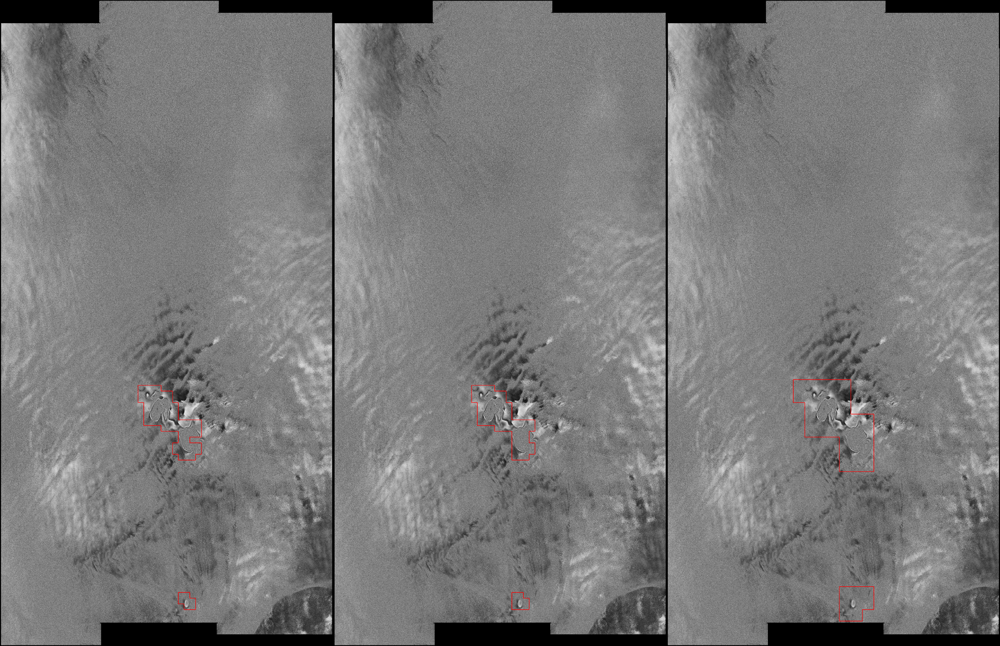
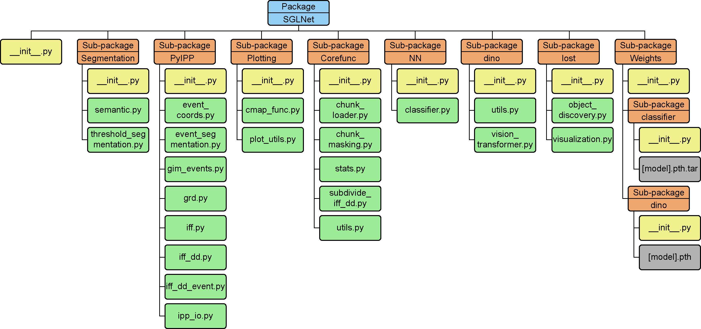
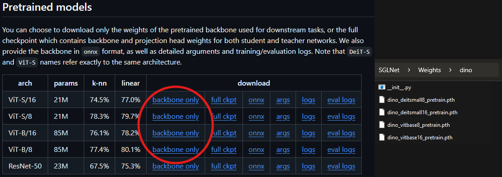
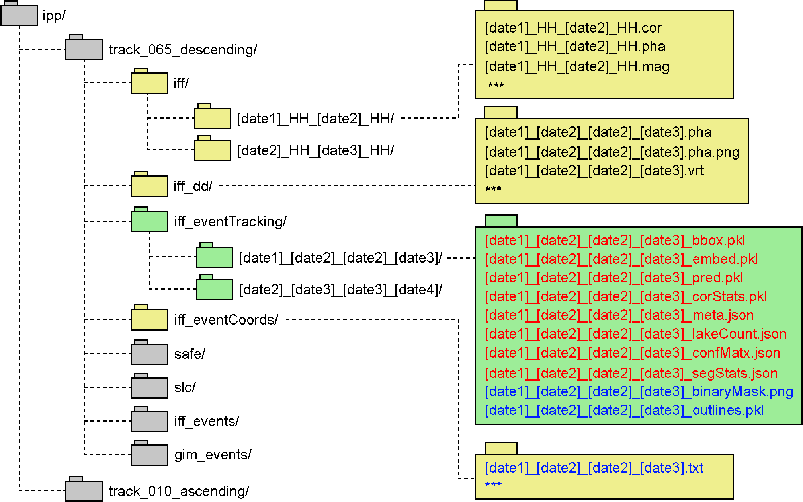

# SGL Detecting from DDInSAR Fringe Patterns with DINO

Automatic detection of subglacial hydrological activity (subglacial lakes, SGL) using vision transformer and linear classifier on Sentinel-1 double difference interferometric synthetic aperture radar (DDInSAR) phase images.<br>
DDInSAR is sensitive to transient surface elevation changes in the line of sight direction. These changes show up as spatial fringe patterns and are linked to changes in the subglacial hydrology.<br>

<div align="center">
  
</div>

## Acknowledgement
This work uses self-distillation with no labels (['DINO'](https://arxiv.org/abs/2104.14294)) to extract latent embeddings from phase images, which are used for downstream tasks.<br>
This work also employs localizing objects with self-supervised transformers and no labels (['LOST'](https://arxiv.org/abs/2109.14279)) for segmentation "foreground" object using latent embeddings.

## Executable scripts for Python and SGLNet package
**Main script for inference and prediction**
```
event_tracking_iff_DINO.py
```
**Script for ***experimental*** segmentation**
```
semantic_segmentation.py
```
**Scripts for training and validation**
```
image2trainset.py
train_classifier_head.py
test_network.py
```
**Scripts for testing against ground truth**
```
compute_classification_performance.py
compute_coherence.py
compute_lake_count.py
compute_segmentation_overlap.py
compute_segmentation_performance.py
```
### SGLNet package
All executable scripts above use the SGLNet package shown in the schematic below.

<div align="center">
  
</div>

Scripts and weights* in the `dino` sub-package(s) are from the [[`DINO repository`](https://github.com/facebookresearch/dino/tree/main)] while scripts in the `lost` sub-package are from the [[`LOST repository`](https://github.com/valeoai/LOST)].<br>
**(*)** The SGLNet/Weights/dino currently does not come with the DINO weights due to file size limitations. These can be downloaded from the DINO repository. To do so, choose the <ins>backbone only</ins> option for the four architectures shown in the image below, and place in the `SGLNet/Weights/dino` directory as shown in the image. Make sure the names are as shown.
<div align="center">
  
</div>

### Directories
The script is build around DTU's Interferometric Post-Processing Chain (IPP), with some additional elements added on top. The most important directories and files are shown in the diagram below.

<div align="center">
  
</div>

where ${\textsf{\color{lightgreen}green}}$ directories are created by SGLNet, ${\textsf{\color{yellow}yellow}}$ directories are native to the ipp-processor, but SGLNet interact with them, while ${\textsf{\color{gray}gray}}$ are native ipp directories not directly used by SGLNet. <br>
Files colored in ${\textsf{\color{lightblue}blue}}$ are the **main** ouput(s), being event coordinates and *experimental* segmentation, whereas files in ${\textsf{\color{red}red}}$ are extra outputs, used for testing performance against ground truths and other downstream tasks.

The images at the very top of this page were created using `*_pred.pkl` and `*_bbox.pkl` files, to visualize ViT-windows (aka bboxes) where the model predicts features of interest. The three different views are the outputs of three different DINO configurations.

### Outputs
Here follows a short description of the  output files from the various scripts

**From `event_tracking_iff_DINO.py`**
- `[prodname].txt`: (in iff_eventCoords) txt file with large boundary boxes covering entire regions of interest, compatible with the existing ipp pipeline
- `[prodname]_meta.json`: json file with dictionary containing inference metadata
- `[prodname]_pred.pkl`: numpy pickle file with (N,)-array of predictions (1 = True, 0 = False, -1 = Excluded)
- `[prodname]_embed.pkl`: numpy pickle file with structured array of cls-, patch-, qkv-, and self-attention-embeddings for locations where SGL are predicted
- `[prodname]_bbox.pkl`: numpy pickle file with (N, 4)-array of boundary boxes corresponding to each chunk passes through the ViT
- `[prodname]_img.png`: png image showing the (padded) boundary bboxes plotted onto the iff_dd phase image (for visualization only)

**From `semantic_segmentation.py`**
- `[prodname]_binaryMask.png`: segmentation mask as png image
- `[prodname]_outlines.pkl`: countains array of (200, 2)-arrays with are (x,y) coordinates of smoothed polygons surrounding segmentations.

#### Ground truth testing
**From `compute_lake_count.py`**
- `[prodname]_lakeCount.json`: json file with number of captured lakes from groundtruth test

**From `compute_confusion_matrix.py`**
- `[prodname]_confMatx.json`: json file with confusion matrix component from groundtruth test

**From `compute_segmentation_overlap.py`**
- `[prodname]_segStats.json`: json file with segmentation performance from groundtruth test

**From `compute_segmentation_overlap.py`**
- `[prodname]_segStats.json`: json file with segmentation performance from groundtruth test

**From `compute_coherence.py`**
- `[prodname]_coroStats.pkl`: numpy pickle file with structured array containing coherence of individual bboxes from groundtruth test

## Running detection script
The `event_tracking_iff_DINO.py` script is used to detect SGL and extract event coordinates (padded boundary boxes) of regions of interest.
In it's simplest form, this script is executed as
```
python event_tracking_iff_DINO.py /path/to/iff_dd/file*.pha
```
But then the output also includes files `[prodname]_meta.json`, `[prodname]_pred.pkl`, `[prodname]_embed.pkl`, and `[prodname]_bbox.pkl`, which are optionally used for downstream tasks (such as segmentation, see later chapter). If only event coordinates are of interest, then the script can be executed as
```
python event_tracking_iff_DINO.py /path/to/iff_dd/file*.pha --save_embeddings False --save_predictions False --save_bboxes False --save_metadata False
```
The network is unable to distinguish between SGL and grounding lines (GL). It is possible to give the script a GL mask as a grayscale png with the same resolution as the .pha product, where GL pixels have a value >0 and will not be included in the output. **NOTE**: if the image contains GL and not mask is given (so that output also includes detected grounding lines, then 1) event coordinates will likely be ill-behaved for SGL near grounding lines and 2) the option `--save_embeddings` should be set to False, as otherwise the script will save self-attention embeddings for very large regions, which can take up a lot of diskspace very quickly.<br>
To run the script with a custom mask, use
```
python event_tracking_iff_DINO.py /path/to/iff_dd/file*.pha --gl_mask /path/to/gl/mask.png
```
For more options (such as the VIT model used etc.) please refer to
```
python event_tracking_iff_DINO.py -h
```

## Running segmentation script
The `semantic_segmentation` script can produce crude segmentations of SGL using various techniques:
1) DINO self-attention segmentation
2) PCA of patch embeddings
3) LOST patch embedding segmentation

To run the segmentation algorithm, the `event_tracking_iff_DINO.py` script (see above) must have been executed with `--save_embeddings True --save_metadata True`. This will produce both a `*_embed.pkl` and a `*_meta.json` file for each iff_dd product in the iff_eventTracking directory (see illustration further above).<br>
**Note:** The `*_embed.pkl` files store self-attention matrices, as well as patch and qkv embedding matrices, for all regions where "SGL-like" features are detected (as mentioned above). In order to reduce file sizes and avoid potentially weird segmentation behavior, any products over grounding lines should be evaluated using the additional `--gl_mask` input.

With the necessary `.pkl` and `.json` files, this script can then be executed with a minimum of arguments as
```
python semantic_segmentation.py /path/to/iff_eventTracking/
```
Specific segmentation methods and options can be chosen using `--which_method` and `--which_embeddings`. Read more about these arguments and other options with
```
python semantic_segmentation.py -h
```
